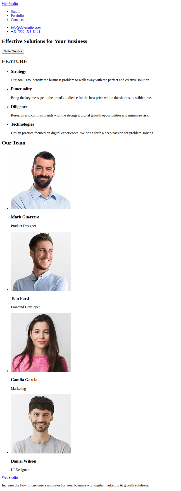
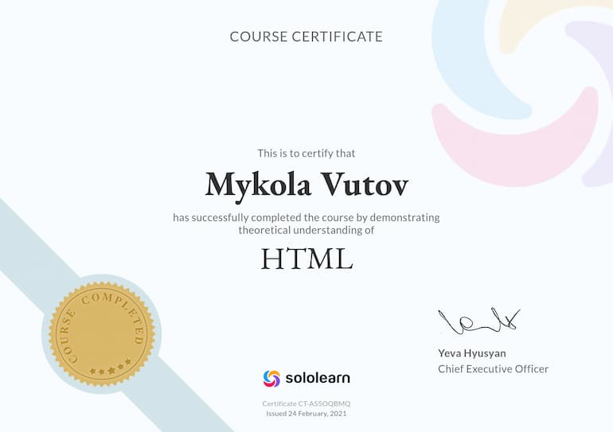
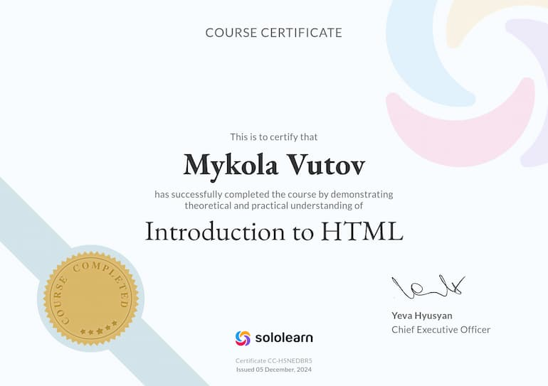

<!-- AUTOGEN:STATS -->
    

## 📸 Latest Screenshot

<!-- END:AUTOGEN -->

## Мої досягнення

 

## Мої сертифікати - Пройшов курс на Sololearn:

[SOLOLEARN](https://www.sololearn.com/certificates/CT-AS5OQBMQ)

[SOLOLEARN](https://www.sololearn.com/certificates/CC-H5NEDBR5)

## 📌 Завдання

- Створити репозиторій `goit-markup-hw-01`.
- Виконати HTML-розмітку макета сторінки домашнього завдання №1, **без CSS-оформлення**.
- Налаштувати **GitHub Pages** та додати посилання на живу сторінку у секцію **About** GitHub-репозиторія.

---

## ✅ Критерії виконання завдання

### **Проєкт**

- `A1` HTML-файл називається **index.html**.
- `A2` У корені проєкту є папка `images` із зображеннями.
- `A3` У назвах файлів відсутні великі літери, кирилиця, пробіли та трансліт; використовуються лише літери та слова англійської мови.
- `A4` Вихідний код відформатований за допомогою **Prettier**.
- `A5` Усі зображення та текстовий контент взяті з макета.
- `A6` Усі растрові зображення оптимізовані за допомогою [Squoosh](https://squoosh.app/).
- `A7` Код написаний згідно з настановами.

### **Розмітка**

- `B1` Розмітка набрана у файлі **index.html**.
- `B2` Виконана HTML-розмітка всіх елементів макета.
- `B3` Теги використані відповідно до їх семантичного змісту.
- `B4` HTML проходить перевірку валідатором без помилок.
- `B5` У розмітці є теги для структури сторінки: `<header>`, `<main>`, `<footer>`.
- `B6` Логотип у хедері та футері — посилання з текстом, а не зображення.
- `B7` Тег `<nav>` використано один раз — у хедері.
- `B8` Контакти у хедері (пошта і телефон) розміщені поза тегом `<nav>`.
- `B9` Тег `<h1>` використано лише один раз на сторінці.
- `B10` Елемент із текстом **Order Service** — кнопка з `type="button"`.
- `B11` Заголовки секцій розмічені тегом `<h2>`.
- `B12` Для `` вказані атрибути розміру (мінімум `width`).
- `B13` Для `` є атрибут `alt` з коротким описом зображення тією ж мовою, що й інший контент.
- `B14` Зображення експортовані у форматі `.jpg`.
- `B15` Групи однотипних елементів зібрані у списки `<ul>`.

---

## 🔗 Жива сторінка

[Відкрити на GitHub Pages](https://vutov-mykola.github.io/goit-markup-hw-01/)

---

## 🛠 Використані технології

- HTML5
- Prettier
- Squoosh
- GitHub Pages
